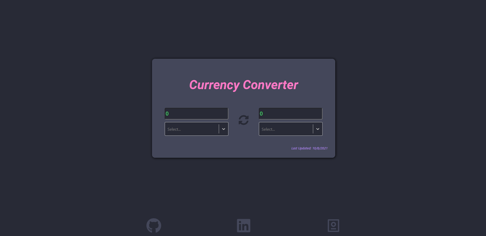
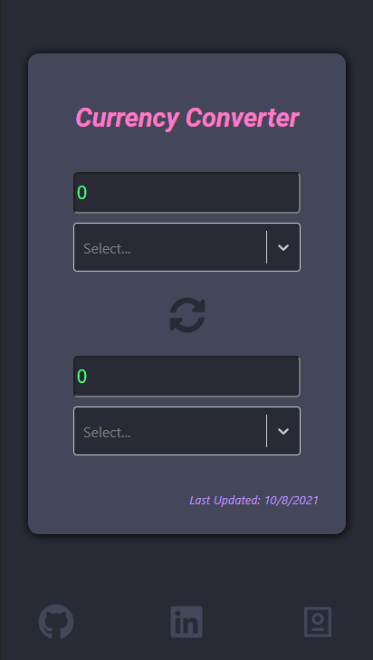

# Currency Convertor

The live version of this app can be found [HERE](http://ak-currencyconverter.herokuapp.com/)

## Description / Usage

This is a simple currency convertor built with ReactJS and SASS for styling. Currencies and their conversion rates are pulled daily for each user from an ExchangeRate API. Due to API limitations, users are limited to 1 update every 24 hours. Changing the currency type or value on either side will update the value of the other. Clicking the button in the middle will swap the values. The 3 icons on the bottom lead to my corresponding profiles. My purpose in building this was to practice my skills building React applications and components using SASS.

## Installation

If you'd like to run the application locally, first you must clone this repo. Once that's complete, simply navigate into the repo's directory and run

```
npm i
```

to install all necessary dependencies. From there, you'll need an API key from [ExchangeRate-API](https://www.exchangerate-api.com/). Once you have that, you can share your API Key with the application by create a .env file in the root of the project. You'll want the .env file to look like this:

```
REACT_APP_API_KEY=[your api key here]
```

This application runs alone without a server backend, so development from there is as simple as running

```
npm run start
```

and editting the code!

## Screenshots

Desktop Layout



Mobile Layout




## Technologies Used

Core: Javascript, ReactJS, NodeJS, CSS, HTML

Styling: SASS

Libraries: [react-select](https://react-select.com/home)

API: [ExchangeRate-API](https://www.exchangerate-api.com/)

## Questions

Contact me at my [Github Profile](https://github.com/AnthonyKrueger)
or my email address: anthonykrueger0@gmail.com


